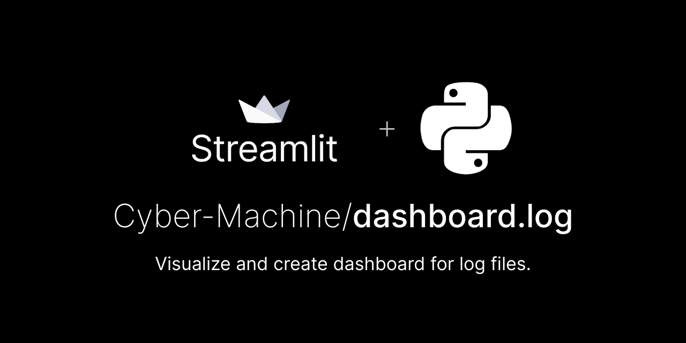

<center> 

[](https://cyber-machine-dashboard-log-app-376gki.streamlitapp.com/)

 </center>

#  <center>     DASHBOARD.log   </center>
<picture>
  <source media="(prefers-color-scheme: light)" srcset="./res/dashboard-log-light.png">
  <source media="(prefers-color-scheme: dark)" srcset="./res/dashboard.log.png">
  
</picture>
Create a dynamic dashboard of your log files by selecting options from the given list of options.
Dashboard.log / LogBoard helps you to :
- Visualize system variables 
- Helps to understand log file

LogBoard is built using [`Streamlit`](https://streamlit.io/) which is powered by [`Python`](https://www.python.org/) and [`Altair`](https://altair-viz.github.io/index.html).

## Getting Started with LogBoard
### Prerequisites 
- An Operating System like Windows, OsX , Linux
- A Python Installation 
- [Git CLI](https://git-scm.com/downloads)

### Installation

Clone the repo

```bash
git clone https://github.com/Cyber-Machine/dashboard.log.git
```

cd into the project root folder

```bash
cd dashboard.log
```

#### Create virtual environment

##### via python

Then you should create a virtual environment named streamlit

```bash
python -m venv streamlit
```

and activate the environment.

On Linux, OsX or in a Windows Git Bash terminal it's

```bash
source streamlit/Scripts/activate
```

or alternatively

```bash
source streamlit/bin/activate
```

In a Windows terminal it's

```bash
streamlit/Scripts/activate.bat
```

##### or via anaconda

Create virtual environment named streamlit

```bash
conda create -n streamlit python=3.7.4
```

and activate environment.

```bash
activate streamlit
```

Then you should install the local requirements

```bash
pip install -r requirements.txt
```


### Build and run the Application Locally

```bash
streamlit run app.py
```


## Contribute

The best way to contribute is via a [Pull request](https://github.com/Cyber-Machine/dashboard.log/pulls) and Github [Issues](https://github.com/Cyber-Machine/dashboard.log/issues)

In the pull request you should make a brief description of changes made.
 
Thanks for your time.

## Future Improvements 

- Adding a `Regex` catcher to catch particular commands / errors in log file.
- `Multi-file support`, a way to integrate log reports of multi log file.
